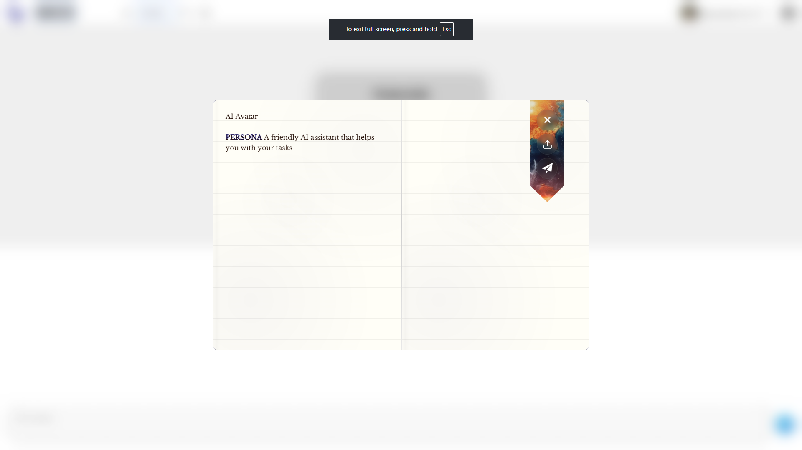

[ ]

Add component simmilar to `textarea-with-counter` but without any counter, just a simple textarea with Tailwind styles.

This component should be named `book-editor` `<BookEditor />` and should be used in the playground page instead of the `TextareaWithCounter`.

---

[ ]

Enhance component `BookEditor`, it should have design and UI according provided screenshot.

-   Text should be larger with font Libre Baskerville
-   It should look like lined paper
-   Highlighted keywords like "PERSONA", "KNOWLEDGE", "EXAMPLE", etc.
-   To get the highlighted keywords, you can use the `getAllCommitmentDefinitions` `createTypeRegex` from `@promptbook/core`.
-   Make design in Tailwind CSS

